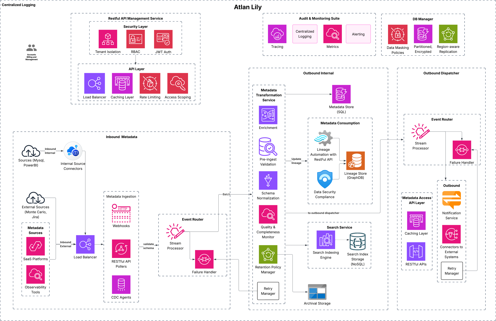

# Atlan-Lily: Real-Time Metadata Platform using Atlan
## Table of Contents
- [Summary](#context--summary)
- [Design Goals & Principles](#design-goals--principles)
- [Requirements](#requirements)
- [Architecture Overview](#architecture-overview)
- [Use Cases](#use-cases)
- [Architecture Diagram](#architecture-diagram)

---


# Summary

Atlan Lily delivers a comprehensive event-driven, modular system design pattern built on real-time metadata flow between internal and external systems, providing a dynamic metadata plane within the data stack, powering data observability, governance, and automation requirements.

This system will be built for scale, and modularity, with authentication, authorization, extensibility, and operational observability. By leveraging an event-driven approach and supporting pre-ingest/post-consume transformation hooks, Atlan Lily ensures seamless metadata flow across diverse data ecosystems, including SaaS tools like Monte Carlo.

---
# Requirements & Assumptions

| **Category**                   | **Details**                                                                 |
|---------------------------------|-----------------------------------------------------------------------------|
| **Functional Requirements**     | 1. Real-time metadata ingestion and consumption of issues. <br> 2. Event-driven architecture for seamless metadata flow. <br> 3. Integration with external tools like JIRA, Slack, Okta, and Monte Carlo. |
| **Non-Functional Requirements** | 1. Scalability to handle 1B+ metadata assets. <br> 2. Low-latency, high-throughput system performance. <br> 3. High availability and fault tolerance. <br> 4. Performance metrics: <br> &nbsp;&nbsp;&nbsp;&nbsp; - Latency: < 100ms for metadata ingestion <br> &nbsp;&nbsp;&nbsp;&nbsp; - Throughput: Handle 10M metadata changes per day. <BR> 5.  Multi-tenant isolation and compliance support.|
| **Security Requirements**       | 1. Robust authentication and authorization (RBAC). <br> 2. Compliance with GDPR, PII regulations. <br> 3. Data encryption in transit and at rest. |
| **Compliance & Governance**     | 1. GDPR and PII tagging enforcement. <br> 2. Audit trails and logging for compliance. |
| **Performance Requirements**    | 1. Support for large-scale metadata estates. <br> 2. Optimized data flow with minimal latency. <br> 3. System should handle 1B+ metadata assets with less than 100ms latency. |
| **Assumptions**                 | 1. The platform will integrate with third-party SaaS tools (JIRA, Slack, etc.). <br> 2. Data sources will be modern cloud-based systems. <br> 3. Customer is billed and managed in the accounts system and requirements will evolve and necessitate modularity for future use cases. <br> 4. External dependencies (APIs, services) will be reliable. <br> 5. On-premise integration not a phase-1 priority. |
| **Limitations**                 | 1. Initial focus on core metadata management; future phases will address advanced AI/automation. <br> 2. Resource constraints may limit real-time monitoring at the scale of the entire ecosystem. <br> 3. Limited support for on-premise tools in the first release. |
| **Dependencies**                | 1. Integration with external SaaS platforms such as JIRA, Slack, and Monte Carlo. <br> 2. External APIs for data observability and monitoring. |
| **Stakeholder Expectations**    | 1. Product teams expect seamless integration with their tools. <br> 2. Compliance teams expect automated reporting and audit trails. |


---
# Atlan Lily: Phases & Prioritization

| **Priority**  | **Focus**                                                                | **Description**                                                                |
|---------------|--------------------------------------------------------------------------|--------------------------------------------------------------------------------|
| **High**      | Core System Foundation                                                   | Establish real-time metadata ingestion, event-driven architecture, and core integrations with security (PII/GDPR). |
| **High**      | SaaS Integrations                                                        | Integrate with external tools like JIRA, Slack, Okta, Monte Carlo for seamless metadata flow. |
| **High**      | Performance & Scalability                                                 | Optimize for large-scale metadata estates (1B+ assets) and ensure low-latency, high-throughput performance. |
| **High**      | Extensibility & Future Use-Cases                                         | Create a modular framework for new integrations and evolving metadata use-cases. |
| **High**      | Observability & Monitoring                                               | Build monitoring tools (logs, metrics, alerts) for proactive system health checks. |
| **High**      | Compliance & Governance                                                  | Implement GDPR/PII tagging, role-based access control (RBAC), and compliance checks. |
| **Long-term** | AI & Automation                                                           | Integrate AI for smarter metadata quality checks and automate data governance workflows. |

---
# Future UI Roadmap for Atlan Lily

| **Phase**    | **UI Focus**                                                   | **Features**                                                     |
|--------------|----------------------------------------------------------------|------------------------------------------------------------------|
| **Phase 2+** | Enhanced Observability & Monitoring                            | Full dashboards for logs, metrics, and alerting visualization    |
| **Phase 2+** | Data & Metadata Exploration                                    | Interactive views for data lineage, asset health, and quality    |
| **Long-Term**| Analytics                                    | Reporting, and advanced analytics |

---

## Design Goals & Principles

### Goals

- Near-real-time metadata capture, enrichment and propagation.
- Scalable and cost effective metadata storage with a capability to process large datasets
- Secure multi-tenant setup with data isolation and compliance
- Entensible architecure with pre/post processing hooks.

### Principles
- **Simplicity:** Use cloud-native components that integrate well with the Atlan platform.
- **Modularity:** Enable easy plug-and-play expansion for new sources and tools.
- **Scalability:** Ensure the system can scale horizontally to handle massive metadata volumes.
- **Observability:** Incorporate robust logging, monitoring, and alerting capabilities for real-time monitoring.

---
### **External APIs** (APIs exposed to customers or external systems):

| **HTTP Method** | **Endpoint**                                | **Purpose**                                                                         |
|-----------------|--------------------------------------------|-------------------------------------------------------------------------------------|
| **POST**        | /api/v1/metadata                           | Ingest metadata from external systems or internal sources (bulk/real-time).         |
| **GET**         | /api/v1/metadata/{id}                      | Retrieve metadata details by ID.                                                    |
| **PUT**         | /api/v1/metadata/{id}                      | Update metadata by ID.                                                              |
| **DELETE**      | /api/v1/metadata/{id}                      | Delete metadata by ID.                                                              |
| **POST**        | /api/v1/metadata/lineage                   | Create or update metadata lineage information.                                      |
| **GET**         | /api/v1/metadata/lineage/{id}              | Retrieve the lineage of a specific metadata asset.                                  |
| **GET**         | /api/v1/metadata/search                    | Search for metadata assets based on parameters like tags, asset type, and filters.  |
| **POST**        | /api/v1/metadata/bulk                      | Process bulk metadata ingestion requests.                                           |
| **GET**         | /api/v1/metadata/bulk/status/{job_id}      | Get the status of a bulk metadata ingestion job.                                    |
| **POST**        | /api/v1/metadata/access-control            | Set access control policies for metadata assets (RBAC, masking rules).              |
| **GET**         | /api/v1/metadata/access-control/{asset_id} | Retrieve access control information for a specific metadata asset.                  |
| **POST**        | /api/v1/metadata/data-quality              | Create or update data quality rules for metadata assets.                            |
| **GET**         | /api/v1/metadata/data-quality/{asset_id}   | Retrieve data quality details for a metadata asset.                                 |
| **POST**        | /api/v1/metadata/notifications             | Trigger notifications for metadata-related events (e.g., schema drift).            |

### **Internal APIs** (APIs used internally for system management and processing):

| **HTTP Method** | **Endpoint**                                | **Purpose**                                                                         |
|-----------------|--------------------------------------------|-------------------------------------------------------------------------------------|
| **POST**        | /api/v1/auth/login                         | User login to generate JWT for API access.                                          |
| **POST**        | /api/v1/auth/logout                        | Log out and revoke the user session.                                                |
| **GET**         | /api/v1/auth/validate                      | Validate JWT token.                                                                 |
| **GET**         | /api/v1/metadata/audit/{asset_id}          | Retrieve audit trail for a specific metadata asset.                                 |
| **POST**        | /api/v1/metadata/external/{system_name}    | Push metadata changes or updates to external systems (e.g., BI tools, other systems). |


---
## Architecture Overview


## Use Cases


---

## Architecture Diagram


---
# Entity Relation for Metadata Store
 

# Sequence of Interaction
## Metadata Ingestion
 
## Bulk Metadata Ingestion

## Metadata Transformation Service
 


## **Atlan Lily Metadata Management API**

This API provides a mechanism to manage metadata assets, notifications, and support for retry and bulk operations. It allows customers to interact with metadata, such as creating, updating, and importing metadata for multiple assets. It also supports the management of notification retries and provides the ability to handle metadata lineage, retention, and notification settings.

### **Base URL**

```
https://api.atlan.com/lily/v1
```

### **Security**

This API requires **JWT** authentication for access.

```json
{
  "security": [
    {
      "BearerAuth": []
    }
  ]
}
```

---

### **Endpoints**

#### **1. POST /metadata**

**Summary:**  
Creates or updates metadata for one or more assets, with support for retry and bulk operations.

**Request Body:**

```json
{
  "metadata": {
    "asset": {
      "asset_name": "string",
      "asset_type": "string",
      "description": "string",
      "tenant_id": "integer",
      "created_at": "string",
      "updated_at": "string"
    },
    "metadata_details": {
      "metadata_key": "string",
      "metadata_value": "string",
      "metadata_source": "string",
      "metadata_type": "string",
      "status": "string",
      "retention_policy": {
        "enabled": "boolean",
        "retention_period_days": "integer",
        "action_after_expiry": "string"
      },
      "downstream_status": "string",
      "downstream_notifications": [
        {
          "system_name": "string",
          "notification_status": "string",
          "attempts": "integer",
          "last_attempted_at": "string",
          "next_attempt_at": "string",
          "notification_type": "string",
          "notification_method": "string",
          "recipient": "string",
          "notification_payload": {
            "ticket_title": "string",
            "ticket_description": "string",
            "ticket_priority": "string",
            "ticket_labels": ["string"],
            "message": "string"
          },
          "status_message": "string"
        }
      ]
    }
  }
}
```

**Responses:**

- `200`: Metadata successfully created or updated.
  
  ```json
  {
    "status": "success",
    "message": "Metadata processed successfully."
  }
  ```

- `400`: Invalid input or missing required fields.
  
- `500`: Internal server error.

---

#### **2. POST /notifications/retry**

**Summary:**  
Retrieves a failed notification and retries sending it.

**Request Body:**

```json
{
  "notification_id": "string",
  "retry_count": 1,
  "reason": "string"
}
```

**Responses:**

- `200`: Notification retry successful.

- `400`: Invalid notification ID or retry data.

- `500`: Failed to retry notification.

---

#### **3. POST /metadata/bulk**

**Summary:**  
Bulk import metadata for one or more assets, supporting retry and bulk operations.

**Request Body:**

```json
{
  "metadata": [
    {
      "asset": {
        "asset_name": "string",
        "asset_type": "string",
        "description": "string",
        "tenant_id": "integer",
        "created_at": "string",
        "updated_at": "string"
      },
      "metadata_details": {
        "metadata_key": "string",
        "metadata_value": "string",
        "metadata_source": "string",
        "metadata_type": "string",
        "status": "string",
        "retention_policy": {
          "enabled": "boolean",
          "retention_period_days": "integer",
          "action_after_expiry": "string"
        },
        "downstream_status": "string",
        "downstream_notifications": [
          {
            "system_name": "string",
            "notification_status": "string",
            "attempts": "integer",
            "last_attempted_at": "string",
            "next_attempt_at": "string",
            "notification_type": "string",
            "notification_method": "string",
            "recipient": "string",
            "notification_payload": {
              "ticket_title": "string",
              "ticket_description": "string",
              "ticket_priority": "string",
              "ticket_labels": ["string"],
              "message": "string"
            },
            "status_message": "string"
          }
        ]
      }
    }
  ]
}
```

**Responses:**

- `200`: Bulk metadata successfully created or updated.

  ```json
  {
    "status": "success",
    "message": "Bulk metadata processed successfully."
  }
  ```

- `400`: Invalid input or missing required fields.

- `500`: Internal server error.

---

### **Security Scheme**

The API uses **Bearer Authentication**. All endpoints require a valid JWT token.

```yaml
securitySchemes:
  BearerAuth:
    type: http
    scheme: bearer
    bearerFormat: JWT
```

---