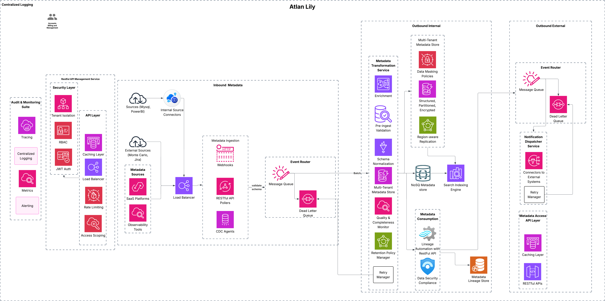
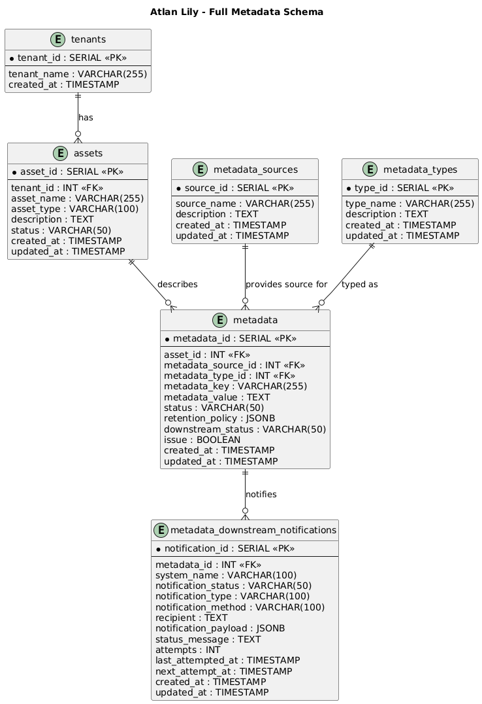
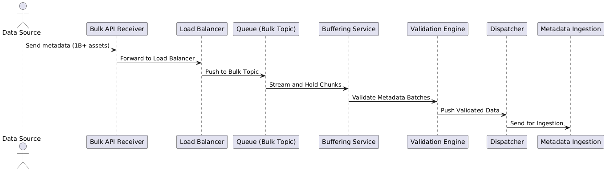
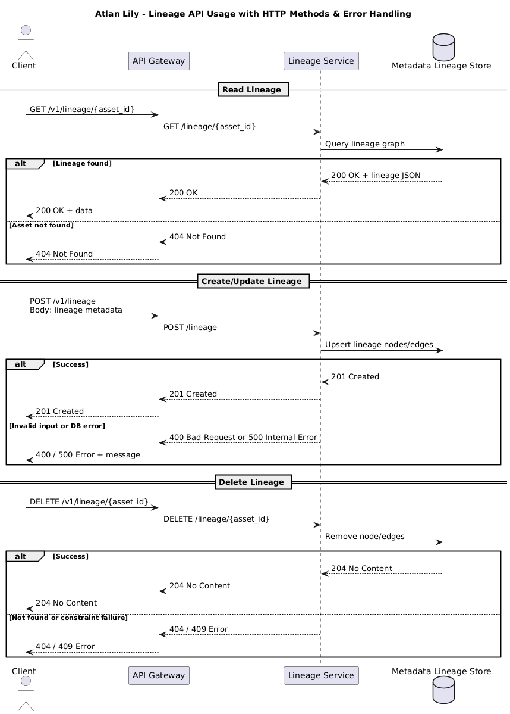

# Atlan-Lily:  Real-Time Metadata Platform using Atlan
## Table of Contents
- [Summary](#context--summary)
- [Design Goals & Principles](#design-goals--principles)
- [Requirements](#requirements)
- [Architecture Overview](#architecture-overview)
- [Use Cases](#use-cases)
- [Architecture Diagram](#architecture-diagram)

---


# Summary

Atlan Lily delivers a comprehensive modular system built on near-real-time metadata flow between internal and external systems, providing a dynamic metadata plane within the data stack, powering data observability, governance, and automation requirements.

This system will be built for scale, and modularity, with authentication, authorization, extensibility, and operational observability. By leveraging an event-driven approach and supporting pre-ingest/post-consume transformation hooks, Atlan Lily ensures seamless metadata flow across diverse data ecosystems, including Mysql, SaaS tools like Monte Carlo, Jira, Grafana.

---
# Requirements & Assumptions

| **Category**                   | **Details**                                                                 |
|---------------------------------|-----------------------------------------------------------------------------|
| **Functional Requirements**     | 1. Near-real-time metadata ingestion and consumption of issues. <br> 2. Support for multiple ingestion methods (CDC, API Polling, Webhooks). <br> 3. Integration with diverse external/internal tools like JIRA, Slack, Okta, and Monte Carlo. <br> 4. Ensure tenant isolation for metadata and secure data segregation. <br> 5. Allow enrichment of metadata with additional attributes. <br> 6. Lineage tracking by capturing, storing, and exposing data flow across systems for query and visualization. <br> 7. Implement granular RBAC for metadata management. <br> 8. Maintain audit trails and trigger alerts in case of data quality issues, failures, and changes. <br>8. Atlan Lily must automatically trigger internal metadata updates for downstream assets in the lineage graph if those assets do not have an active connector, webhook, or polling mechanism configured.<br>9. |
| **Non-Functional Requirements** | 1. Scalability to handle 1B+ metadata assets. <br> 2. Allow ease of new data source integration.<br> 3. Low latency in metadata ingestion and updates.<br> 4. System should be fault-tolerant - achieved through retries and dead-letter queues to handle failures gracefully. <br> 5. Multi-tenant isolation and compliance support. <br>6. System should be horizontally scalable across microservices for performance and operational isolation.|
| **Assumptions**                 | 1. The system operates purely through APIs, with no direct user interface. <br> 2. APIs will handle all interactions with external systems, including metadata ingestion, lineage, and notifications. <br> 3. All API endpoints will support RESTful principles with JSON as the standard data format for requests and responses. <br> 4. Authentication and authorization for all API interactions will be handled via JWT and RBAC. <br> 5. External systems will interact with the platform via APIs (e.g., for metadata ingestion, error reporting, notifications). <br> 6. All external communication protocols (such as Webhooks, CDC, etc.) will be facilitated through API endpoints. <br> 7. Future UI can be built on top of the existing API layer to expose functionalities if needed. <br> 8. The system will be able to scale and handle varying API loads with distributed architecture and load balancing. <br> 9. All API interactions will be logged for auditing purposes and potential error debugging. <br> 10. API endpoints should support high availability and fault tolerance mechanisms. <br> 11. Customers/tenants are managed and billed by the Accounts system. |
| **Limitations**                 | 1. Near-real-time ingestion may be limited by the capabilities of external systems, such as data source latency or rate limits on external APIs. <br> 2. The system is dependent on external data sources' ability to provide consistent, accurate, and timely metadata; inconsistent metadata may result in inaccurate insights. <br> 3. Metadata storage may be constrained by storage limits, affecting the ability to retain historical data over extended periods. |
| **Scope**                       | 1. Ingest metadata from external/internal systems. <br> 2. Near-real-time and batch processing of metadata. <br> 3. Provide APIs to support metadata ingestion, lineage publishing, and outbound event notifications. <br> 4. Ensure system scalability to handle large volumes of metadata and API requests. |
| **Out-of-Scope**                | 1. User interface development is out-of-scope for this phase. <br> 2. Direct integration with proprietary or unsupported external systems is not part of the current scope. <br> 3. Heavy-duty analytics, ML models, or complex processing for metadata enrichment is outside the scope at this stage. |


---
# Atlan Lily: Phases & Prioritization

| **Priority**       | **Focus**                          | **Description**                                                                                 |
|--------------------|------------------------------------|-------------------------------------------------------------------------------------------------|
| **High (Phase 1)** | Core System             |  Real-time metadata ingestion and processing. |
| **High (Phase 1)** | Compliance & Governance            | Implement RBAC, GDPR/PII tagging, and audit trail support for secure and compliant operations.   |
| **High (Phase 1)** | Observability & Monitoring         | Build logs, metrics, alerting, and tracing for operational visibility and incident handling.     |
| **High (Phase 2)** | SaaS & Internal Integrations       | Connect to tools like JIRA, Slack, Monte Carlo, and internal metadata sources (e.g., Synapse).   |
| **High (Phase 2)** | Performance & Scalability          | Optimize ingestion and querying to support 1B+ assets with low latency and high throughput.       |
| **High (Phase 2)** | Extensibility Framework            | Build plugin-style support for connectors and metadata.       |
| **Future (Phase 3)** | AI & Automation                  | Add ML-based data classification, anomaly detection, and automated metadata management.          |

---
# Future UI Roadmap for Atlan Lily

| **Phase**    | **UI Focus**                                                   | **Features**                                                     |
|--------------|----------------------------------------------------------------|------------------------------------------------------------------|
| **Phase 2+** | Enhanced Observability & Monitoring                            | Full dashboards for logs, metrics, and alerting visualization    |
| **Phase 2+** | Data & Metadata Exploration                                    | Interactive views for data lineage, asset health, and quality    |
| **Long-Term**| Analytics                                    | Reporting, and advanced analytics |

---

## Design Goals & Principles

### Goals

- Near-real-time metadata capture, enrichment and propagation.
- Scalable and cost effective metadata storage with a capability to process large datasets
- Secure multi-tenant setup with data isolation and compliance
- Entensible architecure with pre/post processing hooks.

### Principles
- **Simplicity:** Use cloud-native components that integrate well with the Atlan platform.
- **Modularity:** Enable easy plug-and-play expansion for new sources and tools.
- **Scalability:** Ensure the system can scale horizontally to handle massive metadata volumes.
- **Observability:** Incorporate robust logging, monitoring, and alerting capabilities for real-time monitoring.

---
# Restful APIs
## Metadata APIs
| Method | Endpoint                                      | Description                                                  |
|--------|-----------------------------------------------|--------------------------------------------------------------|
| POST   | /metadata                                      | Ingest new metadata (real-time or batch)                     |
| GET    | /metadata/{asset_id}                          | Retrieve metadata by asset ID                                |
| PUT    | /metadata/{asset_id}                          | Update metadata by asset ID                                  |
| DELETE | /metadata/{asset_id}                          | Delete metadata by asset ID                                  |

### Lineage APIs
| Method | Endpoint                                      | Description                                                  |
|--------|-----------------------------------------------|--------------------------------------------------------------|
| POST   | /metadata/lineage                             | Create or update lineage relationships                       |
| GET    | /metadata/lineage/{asset_id}                  | Get lineage graph for an asset                               |
| DELETE | /metadata/lineage/{asset_id}                  | Remove lineage for an asset                                  |

### Access Control & Governance
| Method | Endpoint                                      | Description                                                  |
|--------|-----------------------------------------------|--------------------------------------------------------------|
| POST   | /metadata/access-control                      | Set RBAC policies on an asset                                |
| GET    | /metadata/access-control/{asset_id}           | Get RBAC policy for an asset                                 |
| POST   | /metadata/governance/classification           | Apply classification tags (e.g., PII, GDPR)                  |
| GET    | /metadata/governance/classification/{asset_id}| Retrieve classification tags for an asset                    |
| POST   | /metadata/governance/retention                | Define data retention policy for metadata assets             |
| GET    | /metadata/governance/retention/{asset_id}     | Retrieve retention rules for an asset                        |

### Notification APIs
| Method | Endpoint                                      | Description                                                  |
|--------|-----------------------------------------------|--------------------------------------------------------------|
| POST   | /metadata/notifications                       | Trigger metadata event-based notifications                   |

### Data Quality APIs
| Method | Endpoint                                      | Description                                                  |
|--------|-----------------------------------------------|--------------------------------------------------------------|
| POST   | /metadata/data-quality                        | Add or update data quality rules                             |
| GET    | /metadata/data-quality/{asset_id}             | Get quality status for asset                                 |

### Search & Audit APIs
| Method | Endpoint                                      | Description                                                  |
|--------|-----------------------------------------------|--------------------------------------------------------------|
| GET    | /metadata/search                              | Search metadata using filters, tags, and asset types         |
| GET    | /metadata/audit/{asset_id}                    | Fetch audit logs for metadata changes                        |

### Bulk Ingestion APIs
| Method | Endpoint                                      | Description                                                  |
|--------|-----------------------------------------------|--------------------------------------------------------------|
| POST   | /metadata/bulk                                | Bulk ingest metadata                                          |
| GET    | /metadata/bulk/status/{job_id}                | Check status of a bulk ingest job                            |

---

## Connector & System Config APIs (Non-/metadata scoped)


###  Connectors
| Method | Endpoint                                      | Description                                                  |
|--------|-----------------------------------------------|--------------------------------------------------------------|
| POST   | /connectors/{tenant_id}                       | Register a connector for tenant                              |
| GET    | /connectors/{tenant_id}                       | List connectors configured for tenant                        |
| DELETE | /connectors/{tenant_id}/{connector_id}        | Remove a connector                                           |

### System & Auth
| Method | Endpoint                                      | Description                                                  |
|--------|-----------------------------------------------|--------------------------------------------------------------|
| POST   | /auth/login                                   | Login and generate JWT                                       |
| POST   | /auth/logout                                  | Logout                                                       |
| GET    | /auth/validate                                | Validate token                                               |
| GET    | /system/health                                | Health check for platform                                    |

### Tenant Management
| Method | Endpoint                                      | Description                                                  |
|--------|-----------------------------------------------|--------------------------------------------------------------|
| GET    | /tenants/{tenant_id}/sources                  | List inbound/outbound sources for tenant                     |
| GET    | /tenants/{tenant_id}/config                   | Retrieve tenant-specific configuration                       |

---
## Architecture Overview


## Use Cases


---

## Architecture Diagram


---
# Entity Relation for Metadata Store
 

# Sequence of Interaction
## Metadata Ingestion
 
## Bulk Metadata Ingestion

## Metadata Transformation Service
 


## **Atlan Lily Metadata Management API**

This API provides a mechanism to manage metadata assets, notifications, and support for retry and bulk operations. It allows customers to interact with metadata, such as creating, updating, and importing metadata for multiple assets. It also supports the management of notification retries and provides the ability to handle metadata lineage, retention, and notification settings.

### **Base URL**

```
https://api.atlan.com/lily/v1
```

### **Security**

This API requires **JWT** authentication for access.

```json
{
  "security": [
    {
      "BearerAuth": []
    }
  ]
}
```

---

### **Endpoints**

## Lineage API
 


#### **1. POST /metadata**

**Summary:**  
Creates or updates metadata for one or more assets, with support for retry and bulk operations.

**Request Body:**

```json
{
  "metadata": {
    "asset": {
      "asset_name": "string",            // The name of the asset, e.g., table or column name
      "asset_type": "string",            // The type of the asset, e.g., COLUMN, TABLE, SCHEMA
      "description": "string",           // A brief description of the asset
      "tenant_id": "integer",           // Tenant ID for multi-tenancy (for tenant isolation)
      "created_at": "string",           // Timestamp when the asset was created
      "updated_at": "string"            // Timestamp when the asset was last updated
    },
    "metadata_details": {
      "metadata_key": "string",          // A unique key for identifying metadata (e.g., column_name)
      "metadata_value": "string",        // The value of the metadata (e.g., column type or constraints)
      "metadata_source": "string",      // The source system from where metadata originated (e.g., MySQL, Postgres)
      "metadata_type": "string",        // The type of metadata (e.g., STRUCTURAL, SEMANTIC)
      "status": "string",                // Current status of the metadata (e.g., ACTIVE, INACTIVE, DEPRECATED)
      "retention_policy": {
        "enabled": "boolean",            // Whether retention policy is enabled
        "retention_period_days": "integer", // Number of days the metadata is retained
        "action_after_expiry": "string"  // Action to take after expiry (e.g., ARCHIVE, DELETE)
      },
      "downstream_status": "string",    // Status of metadata in downstream systems (e.g., SYNCHRONIZED, PENDING)
      "downstream_notifications": [
        {
          "system_name": "string",          // Name of the external system for notifications (e.g., Slack, Jira)
          "notification_status": "string",  // Notification status (e.g., SENT, FAILED)
          "attempts": "integer",            // Number of attempts for sending notifications
          "last_attempted_at": "string",    // Timestamp of the last attempt
          "next_attempt_at": "string",      // Timestamp of the next scheduled attempt
          "notification_type": "string",    // Type of notification (e.g., ALERT, INFO, WARNING)
          "notification_method": "string",  // Method used for notification (e.g., EMAIL, API, SLACK)
          "recipient": "string",            // The recipient of the notification (e.g., user, group)
          "notification_payload": {
            "ticket_title": "string",        // Title of the ticket for issues (if applicable)
            "ticket_description": "string",  // Description of the issue or alert
            "ticket_priority": "string",     // Priority of the ticket (e.g., LOW, MEDIUM, HIGH)
            "ticket_labels": ["string"],     // Labels for categorizing the ticket (e.g., bug, feature request)
            "message": "string"              // The actual message or notification content
          },
          "status_message": "string"         // Detailed status message regarding the notification
        }
      ]
    }
  }
}

```

**Responses:**

- `200`: Metadata successfully created or updated.
  
  ```json
  {
    "status": "success",
    "message": "Metadata processed successfully."
  }
  ```

- `400`: Invalid input or missing required fields.
  
- `500`: Internal server error.

---

#### **2. POST /notifications/retry**

**Summary:**  
Retrieves a failed notification and retries sending it.

**Request Body:**

```json
{
  "notification_id": "string",
  "retry_count": 1,
  "reason": "string"
}
```

**Responses:**

- `200`: Notification retry successful.

- `400`: Invalid notification ID or retry data.

- `500`: Failed to retry notification.

---

---

### **Security Scheme**

The API uses **Bearer Authentication**. All endpoints require a valid JWT token.

```yaml
securitySchemes:
  BearerAuth:
    type: http
    scheme: bearer
    bearerFormat: JWT
```

---