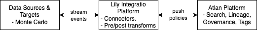
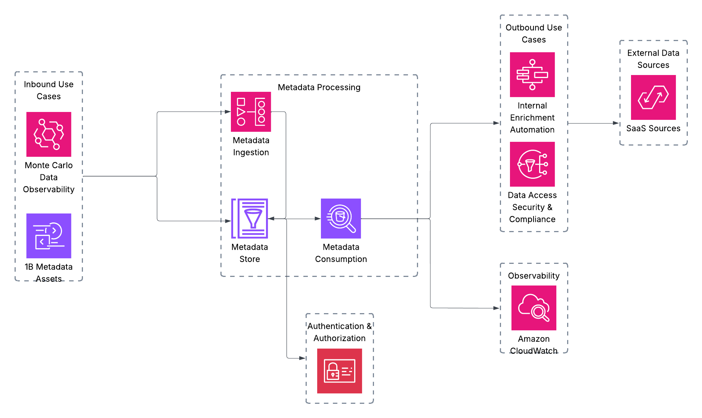
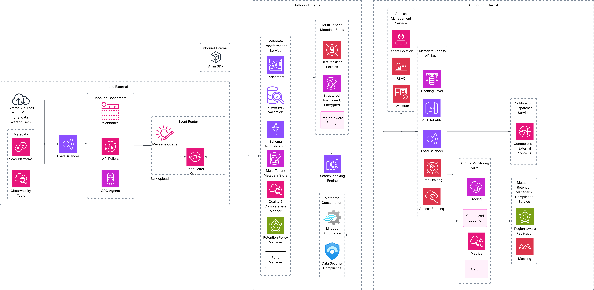

# Atlan-Lily: Real-Time Metadata Platform using Atlan
## Table of Contents
- [Summary](#context--summary)
- [Design Goals & Principles](#design-goals--principles)
- [Requirements](#requirements)
- [Architecture Overview](#architecture-overview)
- [Use Cases](#use-cases)
- [Architecture Diagram](#architecture-diagram)

---

# Summary

Atlan Lily delivers a comprehensive three-tier architecture that enables real-time metadata flow between internal and external systems, providing a dynamic metadata plane within the data stack, powering data observability, governance, and automation requirements.

This system will be built for scale, and modularity, with authentication, authorization, extensibility, and operational observability. By leveraging an event-driven approach and supporting pre-ingest/post-consume transformation hooks, Atlan Lily ensures seamless metadata flow across diverse data ecosystems, including SaaS tools like Monte Carlo.

---

## Design Goals & Principles

### Goals

- Near-real-time metadata capture, enrichment and propagation.
- Scalable and cost effective metadata storage with a capability to process large datasets
- Secure multi-tenant setup with data isolation and compliance
- Entensible architecure with pre/post processing hooks.

### Principles
- **Simplicity:** Use cloud-native components that integrate well with the Atlan platform.
- **Modularity:** Enable easy plug-and-play expansion for new sources and tools.
- **Scalability:** Ensure the system can scale horizontally to handle massive metadata volumes.
- **Observability:** Incorporate robust logging, monitoring, and alerting capabilities for real-time monitoring.

---
## Requirements
## Functional Requirements
1. Inbound connectors to ingest metadata from external sources(e.g. Monte Carlo, Slack, Jira) via webhooks, API polling or Change Data Capture(CDC)
2. Metadata Transformation to convert raw metadata from various sources to standardized model, applying necessary pre/post transformations and enrichment.
3. Support real-time metadata updates using event-driven architecture
4. Enable communication between source systems, processing engines, and outbound connector with minimal delay.
5. Provider outbound connectors to push metadata changes to external systems like Jira.
6. Expose restful apis for metadata access and consumption
7. Search service must support full-text search, autocomplete capabilities with near real-time indexing for metadata discovery.
8. Support tagging of metadata (gdpr compliance) for downstream enforcement.
9. Implement RBAC to restrict metadata access
10. Implement rate limiting to prevent abuse of api
11. Implement caching for frequest metadata with TTL-based invalidation to optimize performance and reduce database load
12. Real-time monitoring with alerting and audit logging for all metadata processing activities
13. Load balance request across connectors and APIs to support traffic distribution and failover.
14. Support ingestion and querying of metadata georgraphical regions while ensuring data residency compliance(EU-US data transfer)
15. Configure time-based or condition based metadata retention policy.
16. Monitor and report metadata quality and completeness.
17. Maintain and process failed metadata events with dead letter queue.
## Non Functional Requirements
1. System must scale across services like metadata ingestion, event bus, and metadata storage. 
2. Low latency and high throughput
3. Fault tolerant with high availability
4. Encrypt metadata at rest and in transit.
5. Implement RBAC with fine grained policies and JWT-based secure authentication support tenant-aware querying/access scoping.
6. Plug and play design with versioning
7. Cost efficient with cloud native features like auto-scaling
8. Ensure regulatory compliance wrt data transfer.
9. System must support region specific deployments
10. Enforce per tenant and per user API quotas to ensure fair usage.
11. Integrate structured logging, telemetry, real-time metrics collection across ingestion and processing pipelines.

## Assumptions
Atlan Lily primarily handles metadata ingestion, data quality issues, and observability signals, but does not process raw data-level Change Data Capture (CDC) events.
1. The system will handle metadata flows from both large-scale data sources and smaller, frequent updates 
2. Each tenant's metadata will be logically isolated via schema-level or database-level partitioning, with access scoping enforced.
3. System will be deployed on scalable cloud based infrastructure, leveraging managed services
4. Metadata replication across region will only included non-sensitive/masked attributes
5. All underlying infrastructure are provisioned using cloud-native, managed services for reliability and auto scaling.

---
## Architecture Overview

## Use Cases

---

## Architecture Diagram

---
