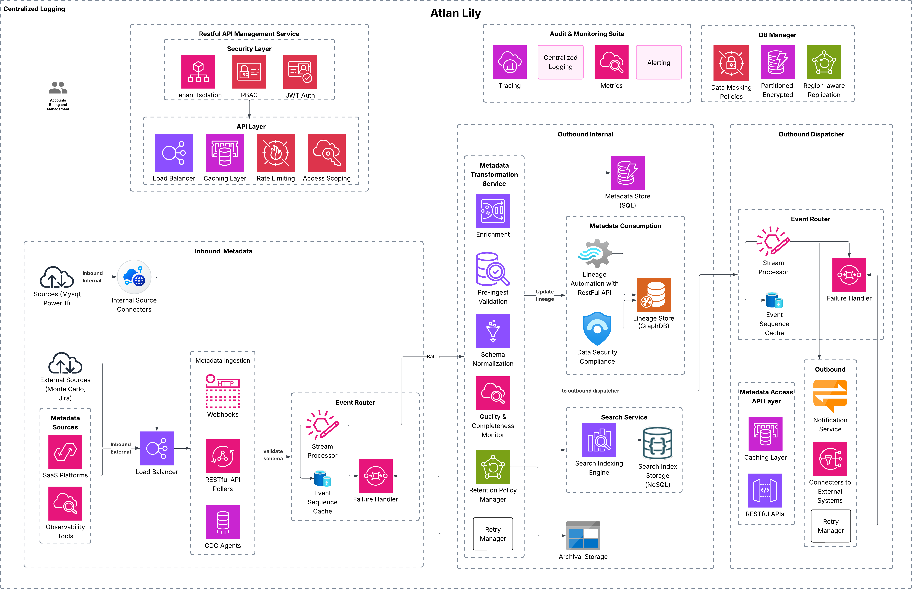

# Atlan-Lily:  Real-Time Metadata Platform using Atlan
## Table of Contents
- [Summary](#summary)
- [Requirements & Assumptions](#requirements--assumptions)
- [Design Goals & Principles](#design-goals--principles)
- [Atlan Lily: Phases & Prioritization](#atlan-lily-phases--prioritization)
- [Future UI Roadmap for Atlan Lily](#future-ui-roadmap-for-atlan-lily)
- [Architecture Diagram](#architecture-diagram)
- [Sequence of Interaction](#sequence-of-interaction)
  - [Metadata Ingestion](#metadata-ingestion)
  - [Metadata Transformation Service](#metadata-transformation-service)
  - [Outbound Dispatcher Service](#outbound-dispatcher-service)
- [Back-of-the-Envelope Estimation](#back-of-the-envelope-estimation)
  - [Core Architectural Components](#core-architectural-components)
  - [Infra Cost Breakdown](#infra-cost-breakdown)
  - [Total Estimated Cost](#total-estimated-cost)
- [Atlan Lily Metadata Management API](#atlan-lily-metadata-management-api)
  - [Base URL](#base-url)
  - [Metadata APIs](#metadata-apis)
  - [Lineage APIs](#lineage-apis)
  - [Access Control & Governance](#access-control--governance)
  - [Notification APIs](#notification-apis)
  - [Data Quality APIs](#data-quality-apis)
  - [Search & Audit APIs](#search--audit-apis)
  - [Bulk Ingestion APIs](#bulk-ingestion-apis)
  - [Connector & System Config APIs](#connector--system-config-apis)
  - [Security](#security)
- [Programming Language & Containerization](#programming-language--containerization)
- [CI/CD Pipeline & Automation](#cicd-pipeline--automation)
- [Tenancy & Deployment](#tenancy--deployment)
  - [Deployment Options](#deployment-options)
- [Service Level Agreement](#service-level-agreement)
- [Prototype Implementation](#prototype-implementation)

---


# Summary

Atlan Lily is a metadata management platform designed to solve real-time data observability, governance, and automation at scale. It relies on seamless metadata flow across diverse sources including databases, SaaS tools like Monte Carlo, Jira, Grafana while supporting data transformations across systems. With robust security, multi-tenancy support, and an API first approach, Atlan Lily enables organizations to setup an automated metadata management, with lineage tracking to improve data quality, ensure compliance, and operational efficiency. 

---
# Requirements & Assumptions

| **Category**                   | **Details**                                                                 |
|---------------------------------|-----------------------------------------------------------------------------|
| **Functional Requirements**     |1. Near-real-time metadata ingestion and consumption of issues. <br> 2. Support for multiple ingestion methods (CDC, API Polling, Webhooks). <br> 3. Integration with diverse external/internal tools like JIRA, Slack, Okta, and Monte Carlo. <br> 4. Ensure tenant isolation for metadata and secure data segregation. <br> 5. Allow enrichment of metadata with additional attributes. <br> 6. Lineage tracking by capturing, storing, and exposing data flow across systems for query and visualization. <br> 7. Implement granular RBAC for metadata management. <br> 8. Maintain audit trails and trigger alerts in case of data quality issues, failures, and changes. <br>8. Atlan Lily must automatically trigger internal metadata updates for downstream assets in the lineage graph if those assets do not have an active connector, webhook, or polling mechanism configured. <br>9.Support error handling and retries for ingestion.<br>10. Metadata events are processed in the order received to maintain data integrity and lineage|
| **Non-Functional Requirements** | 1. Scalability to handle 1B+ metadata assets. <br> 2. Allow ease of new data source integration.<br> 3. Low latency in metadata ingestion and updates.<br> 4. System should be fault-tolerant - achieved through retries and dead-letter queues to handle failures gracefully. <br> 5. Multi-tenant isolation and compliance support. <br>6. System should be horizontally scalable across microservices for performance and operational isolation. <br> 7.Modular deployable units — supports per-tenant infra via Terraform stack.<br>8.Data retention and archiving|
| **Assumptions**                 | 1. The system operates purely through APIs, with no direct user interface. <br> 2. APIs will handle all interactions with external systems, including metadata ingestion, lineage, and notifications. <br> 3. All API endpoints will support RESTful principles with JSON as the standard data format for requests and responses. <br> 4. Authentication and authorization for all API interactions will be handled via JWT and RBAC. <br> 5. The system will rely on cloud infrastructure for scalability, fault tolerance, and high avialability, with no significant infra setuo required from end user. <br> 6. All external communication protocols (such as Webhooks, CDC, etc.) will be facilitated through API endpoints. <br> 7. Future UI can be built on top of the existing API layer to expose functionalities if needed. <br> 8. The system will be able to scale and handle varying API loads with distributed architecture and load balancing. <br> 9. All API interactions will be logged for auditing purposes and potential error debugging. <br> 10. API endpoints should support high availability and fault tolerance mechanisms. <br> 11. Customers/tenants are managed and billed by the Accounts system. |
| **Limitations**                 | 1. Near-real-time ingestion may be limited by the capabilities of external systems, such as data source latency or rate limits on external APIs. <br> 2. The system is dependent on external data sources' ability to provide consistent, accurate, and timely metadata; inconsistent metadata may result in inaccurate insights. <br> 3. Metadata storage may be constrained by storage limits, affecting the ability to retain historical data over extended periods. |
| **Scope**                       | 1. Ingest metadata from external/internal systems. <br> 2. Near-real-time and batch processing of metadata. <br> 3. Provide APIs to support metadata ingestion, lineage publishing, and outbound event notifications. <br> 4. Ensure system scalability to handle large volumes of metadata and API requests. <br>5. Metadata validation and quality checks<br>6.Lineage, audit and compliance tracking.|
| **Out-of-Scope**                | 1. User interface development is out-of-scope for this phase. <br> 2. Direct integration with proprietary or unsupported external systems is not part of the current scope. <br> 3. Heavy-duty analytics, ML models, or complex processing for metadata enrichment is outside the scope at this stage. |


---
# Atlan Lily: Phases & Prioritization

| **Priority**       | **Focus**                          | **Description**                                                                                 |
|--------------------|------------------------------------|-------------------------------------------------------------------------------------------------|
| **Phase 1** | Core System             |  Real-time metadata ingestion and processing. |
| **Phase 1** | Compliance & Governance            | Implement RBAC, GDPR/PII tagging, and audit trail support for secure and compliant operations.   |
| **Phase 1** | Observability & Monitoring         | Track logs, metrics, alerting, and tracing for operational visibility and incident handling.     |
| **Phase 2** | SaaS & Internal Integrations       | Connect to tools like JIRA, Slack, Monte Carlo, and internal metadata sources (e.g., Mysql).   |
| **Phase 2** | Performance & Scalability          | Optimize ingestion and querying to support 1B+ assets with low latency and high throughput.       |
| **Phase 2** | Extensibility Framework            | Build plugin-style support for connectors and metadata.       |
| **Phase 3** | AI & Automation                  | Add ML-based data classification, anomaly detection, and automated metadata management.          |

---
# Future UI Roadmap for Atlan Lily

| **Phase**    | **UI Focus**                                                   | **Features**                                                     |
|--------------|----------------------------------------------------------------|------------------------------------------------------------------|
| **Phase 2+** | Enhanced Observability & Monitoring                            | Full dashboards for logs, metrics, and alerting visualization    |
| **Phase 2+** | Data & Metadata Exploration                                    | Interactive views for data lineage, asset health, and quality    |
| **Long-Term**| Analytics                                    | Reporting, and advanced analytics |

---

# Design Goals & Principles

### Goals

- Near-real-time metadata capture, enrichment and propagation.
- Scalable and cost effective metadata storage with a capability to process large datasets
- Secure multi-tenant setup with data isolation and compliance
- Entensible architecure with pre/post processing hooks.

### Principles
- **Simplicity:** Use cloud-native components that integrate well with the Atlan platform.
- **Modularity:** Enable easy plug-and-play expansion for new sources and tools.
- **Scalability:** Ensure the system can scale horizontally to handle massive metadata volumes.
- **Observability:** Incorporate robust logging, monitoring, and alerting capabilities for real-time monitoring.
---
## Use Cases


---

# Architecture Diagram


# Sequence of Interaction
## Metadata Ingestion
 
## Metadata Transformation Service
 
## Outbound Dispatcher Service


---
# **Atlan Lily Metadata Management API**
### **Open API Spec**

[Atlan Lily Open API Spec](atlan-lily-v1.yaml)

### **Base URL**

```
https://api.atlan.com/lily/v1
```

## Metadata APIs
| Method | Endpoint                                      | Description                                                  |
|--------|-----------------------------------------------|--------------------------------------------------------------|
| POST   | /metadata                                      | Ingest new metadata (real-time or batch)                     |
| GET    | /metadata/{asset_id}                          | Retrieve metadata by asset ID and history with pagination                                |
| PUT    | /metadata/{asset_id}                          | Update metadata by asset ID                                  |
| DELETE | /metadata/{asset_id}                          | Delete metadata by asset ID                                  |

### Lineage APIs
| Method | Endpoint                                      | Description                                                  |
|--------|-----------------------------------------------|--------------------------------------------------------------|
| POST   | /metadata/lineage                             | Create or update lineage relationships                       |
| GET    | /metadata/lineage/{asset_id}                  | Get lineage graph for an asset                               |
| DELETE | /metadata/lineage/{asset_id}                  | Remove lineage for an asset                                  |

### Access Control & Governance
| Method | Endpoint                                      | Description                                                  |
|--------|-----------------------------------------------|--------------------------------------------------------------|
| POST   | /metadata/access-control                      | Set RBAC policies on an asset                                |
| GET    | /metadata/access-control/{asset_id}           | Get RBAC policy for an asset                                 |
| POST   | /metadata/governance/classification           | Apply classification tags (e.g., PII, GDPR)                  |
| GET    | /metadata/governance/classification/{asset_id}| Retrieve classification tags for an asset                    |
| POST   | /metadata/governance/retention                | Define data retention policy for metadata assets             |
| GET    | /metadata/governance/retention/{asset_id}     | Retrieve retention rules for an asset                        |

### Notification APIs
| Method | Endpoint                                      | Description                                                  |
|--------|-----------------------------------------------|--------------------------------------------------------------|
| POST   | /metadata/notifications                       | Trigger metadata event-based notifications                   |

### Data Quality APIs
| Method | Endpoint                                      | Description                                                  |
|--------|-----------------------------------------------|--------------------------------------------------------------|
| POST   | /metadata/data-quality                        | Add or update data quality rules                             |
| GET    | /metadata/data-quality/{asset_id}             | Get quality status for asset                                 |

### Search & Audit APIs
| Method | Endpoint                                      | Description                                                  |
|--------|-----------------------------------------------|--------------------------------------------------------------|
| GET    | /metadata/search                              | Search metadata using filters, tags, and asset types         |
| GET    | /metadata/audit/{asset_id}                    | Fetch audit logs for metadata changes                        |

### Bulk Ingestion APIs
| Method | Endpoint                                      | Description                                                  |
|--------|-----------------------------------------------|--------------------------------------------------------------|
| POST   | /metadata/bulk                                | Bulk ingest metadata                                          |
| GET    | /metadata/bulk/status/{job_id}                | Check status of a bulk ingest job                            |

---

## Connector & System Config APIs (Non-/metadata scoped)


###  Connectors
| Method | Endpoint                                      | Description                                                  |
|--------|-----------------------------------------------|--------------------------------------------------------------|
| POST   | /connectors/{tenant_id}                       | Register a connector for tenant                              |
| GET    | /connectors/{tenant_id}                       | List connectors configured for tenant                        |
| DELETE | /connectors/{tenant_id}/{connector_id}        | Remove a connector                                           |

### System & Auth
| Method | Endpoint                                      | Description                                                  |
|--------|-----------------------------------------------|--------------------------------------------------------------|
| POST   | /auth/login                                   | Login and generate JWT                                       |
| POST   | /auth/logout                                  | Logout                                                       |
| GET    | /auth/validate                                | Validate token                                               |
| GET    | /system/health                                | Health check for platform                                    |

### Tenant Management
| Method | Endpoint                                      | Description                                                  |
|--------|-----------------------------------------------|--------------------------------------------------------------|
| GET    | /tenants/{tenant_id}/sources                  | List inbound/outbound sources for tenant                     |
| GET    | /tenants/{tenant_id}/config                   | Retrieve tenant-specific configuration                       |

### **Security**

This API requires **JWT** authentication for access.

```json
{
  "security": [
    {
      "BearerAuth": []
    }
  ]
}
```
---
# Back-of-the-Envelope Estimation
Estimated monthly cost and infra footprint for processing real-time metadata events from
- 5000 daily active users (DAUs),
- 30M metadata events/month (~2 KB/event)
- Across multi tenant SaaS usage(shared, isolated resources)

## Core Architectural Components

| Layer                     | Technology                        | Purpose                                           |
|---------------------------|-----------------------------------|--------------------------------------------------|
| **Stream Processor**       | Kafka Streams                     | Real-time enrichment, validation, routing        |
| **Metadata Store**         | Postgres                          | Structured metadata, scoped per tenant           |
| **Search Engine**          | Elastic Search                        | Index and search metadata (full-text search, filtering, discovery).             |
| **Graph Engine**           | Neo4j / Neptune                   | Lineage, asset relationships                     |
| **Orchestration**          | EKS       | Rebuilds, audits, scheduled jobs, containerized workloads |
| **Auth**                   | OAuth2 + JWT                      | Stateless AuthN, fine-grained AuthZ              |
| **Secrets Store**          | AWS Secrets Manager / Vault       | DB creds, tokens, rotated automatically          |
| **Caching**                | Redis                             | JWT tokens + event version tracking              |
| **Observability**          | Prometheus + Grafana        | Monitoring, alerting, logs                       |


## 🔁 Infra Cost Breakdown (With Detailed Estimates)

| Component                    | Description                                              | Est. Monthly Cost       | Cost Breakdown Explanation  |
|-----------------------------|----------------------------------------------------------|--------------------------|-----------------------------|
| **Kafka + Streams**         | Event ingestion + transformation                         | ~$1,000                  | - Kafka cluster: ~$0.15/hour/node (x3 nodes) <br> - Kafka Streams (processing) + storage: ~15% of overall system cost |
| **Object Storage (S3)**     | Raw + enriched metadata events (~60 GB)                  | ~$2                      | - AWS S3 standard storage: ~$0.023 per GB/month <br> - (~60GB * $0.023) = $1.38 |
| **Metadata DB (Postgres)**  | Structured metadata, multi-tenant scoped                 | ~$400                    | - AWS RDS (db.t3.medium): ~$0.046/hour <br> - 730 hours/month (avg. runtime) = ~$33.58 <br> - 50GB storage (5,000 DAUs), backup costs, etc. = ~$367/month |
| **Search (Elastic Seach)**     | Indexed metadata (full-text + filters)                   | ~$1,500                  | - Elastic Cloud (2 x 4GB RAM nodes, 100GB storage) |
| **Graph DB (Neo4j/Neptune)**| Lineage, joins, relationships                            | ~$1,200                  | - AWS Neptune DB (~db.r5.large): ~$0.75/hour <br> - Storage & queries (~500K edges) + backups cost <br> - Estimated at ~$1,200/month |
| **OAuth2/JWT Auth**         | Stateless token auth + scope-based roles                 | ~$300                    | - Managed auth with AWS Cognito/Auth0 (~$0.005 per 1,000 active users) <br> - JWT token storage & lifecycle management <br> - Estimated at ~$300/month |
| **Secrets Management**      | Rotated DB creds/API keys (100 secrets, daily access)    | ~$100                    | - AWS Secrets Manager (~$0.40 per secret stored/month) <br> - 100 secrets x $0.40 = ~$40 <br> - API calls cost (~$60/month) |
| **Redis (Caching)**         | JWT tokens (TTL) + event order deduping                  | ~$150                    | - AWS ElastiCache (t3.small): ~$0.028/hour <br> - 730 hours/month x $0.028 = ~$20/month <br> - Redis storage for token events (~5-10GB) + additional caching layers for event order deduping |
| **Orcestration**         | Graph rebuilds, audits, lineage rehydration              | ~$500                    | - Managed : ~$0.1/hour (x2 nodes for scheduling) <br> - Storage for DAGs, task logs <br> - Estimated processing for graph rebuilds + lineage audits: ~$500/month |
| **Load Balancer (ALB)**     | Public entrypoint, 10M reqs/month                        | ~$75                     | - AWS ALB (Application Load Balancer): ~$0.0225 per LCU-hour <br> - 10M requests/month <br> - ALB + 3.5LCU hours for routing = ~$75/month |
| **Observability**           | Logs, metrics, traces                                    | ~$500                    | - AWS CloudWatch (logs, metrics): ~$0.50 per GB of logs ingested <br> - Prometheus + Grafana monitoring <br> - Estimated at ~2GB of logs per day (including traces) = ~$500/month |
| **Networking + Egress**     | SaaS webhooks, cross-AZ traffic                          | ~$300                    | - AWS Data Transfer: ~$0.09/GB (cross-AZ, internet egress) <br> - Estimated 5GB/day for webhook/API traffic (5,000 DAUs generating 1KB of data each) = ~$300/month |

---

### 💡 Total Estimated Cost

| Resource                   | Monthly Cost Estimate |
|---------------------------|-----------------------|
| **Total**                  | **~$6,027/month**     |


# **Programming Language & Containerization**

In addition to the core components and technologies listed, it is important to carefully consider the **programming language** and **containerization** technologies that will power the Atlan Lily system. Here’s an analysis of the considerations for both:

---

### **1. Programming Language**
   **Python**: Python is ideal for data manipulation and validation, with a large ecosystem of libraries for working with metadata and schemas (e.g., PyArrow, pandas, etc.). It is chosen to ensure the development of scalable, maintainable, and performant services and components. 

---

### **3. CI/CD Pipeline & Automation**
   To automate code deployments, ensuring continuous integration and continuous delivery of code to production.

   | **Component**             | **Technologies Considered**          | **Final Decision & Reasoning**                                                  |
   |--------------------------|-------------------------------------|---------------------------------------------------------------------------------|
   | **Continuous Integration (CI)** | Jenkins, GitHub Actions, CircleCI   | **GitLab CI/CD**: A fully integrated environment, supporting Docker and Kubernetes natively for automated testing, build, and deployment pipelines. |
   | **Continuous Delivery (CD)**    | Spinnaker, GitLab CI/CD, ArgoCD     | **GitLab CI/CD**: Can handle automated deployments directly to AWS and Kubernetes, simplifying the end-to-end process. |
   | **Version Control**       | GitHub, GitLab, Bitbucket           | **GitLab**: Integrated with GitLab CI/CD, offering a streamlined workflow and version control management. |

---
## Tenancy & Deployment

- **Default Setup**: All platform services are defaulted to **Multi-Tenant**.
- **Complete Isolation**: Achieved using **Terraform** for provisioning.
- **Customer Isolation Matrix**: Tracks customer preferences for shared vs. isolated deployment.

### Deployment Options

#### **Isolated Deployment**  
- Option to provision **dedicated databases/services** per tenant for full isolation.

#### **Shared Deployment**

- **Metadata Store (SQL)**  
  Uses a common SQL database (e.g., PostgreSQL) with `tenant_id` as a partitioning key.

- **Search & Indexing Engine (NoSQL)**  
  Multi-tenant indexes, logically separated by `tenant_id` in a single **elastic search** cluster.

- **Lineage Store (GraphDB)**  
  Shared **GraphDB** (e.g., **Neptune**) with **per-tenant subgraphs**.


## Service Level Aggrement
- 99.9% uptime on the system.
- <5s metadata ingestion, <2s search, <5s lineage, supporting up to 10k concurrent users.


## Prototype Implementation
For inbound/outbound prototype APIs, check out the [Prototype README](app/README.md).

### Final Considerations

As we move forward with **Atlan Lily**, continuous focus on **performance optimization**, **security enhancements**, and **customer feedback loops** will ensure the platform evolves to meet emerging needs while maintaining its core promise of enabling **real-time metadata management at enterprise scale**.
