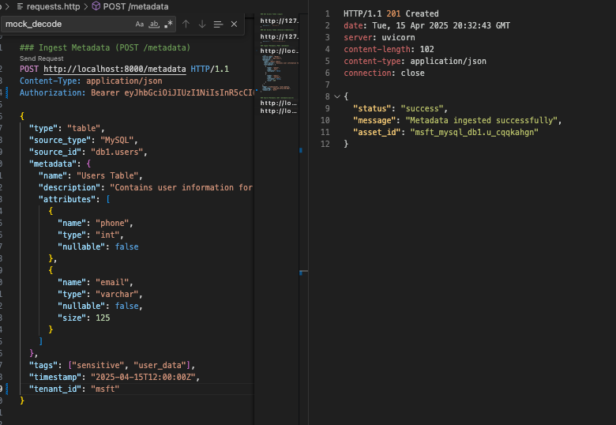

# Atlan Lily Prototype

The prototype covers basic inbound and outbound metadata workflows, including validation, authentication, and mock persistence.

## Features:
### Inbound: Metadata Ingestion
- **Endpoint**: `POST /metadata`  
- **Description**: Ingests metadata into the system. Validates input using JSON schema.
- **Response**: Returns a unique `asset_id` for the ingested metadata.

### Outbound: Metadata Search
- **Endpoint**: `GET /metadata/search?query={keyword}`  
- **Description**: Searches metadata assets based on asset ID or name.
- **Response**: Paginated list of metadata assets matching the query.

### Other considerations
- **Security**: JWT authentication for all endpoints.
- **Tech Stack**: Python FastAPI, Search Service, Postgres Database, Docker, pytest, JWT.

### Generate Token


### Inbound metadata ingestion 200 OK
Successful metadata ingestion via POST /metadata, returning the generated asset_id.


### Inbound Unauthorized acccess 401 Error


### Inbound Invalid Input 422 Error
Metadata ingestion failed due to invalid input format or missing required fields.


### Outbound 200 OK
Successful search via GET /metadata/search with 


## VS Code Setup

### Markdown Preview
For previewing this README and other documentation:
1. Open any `.md` file
2. Press `Ctrl+Shift+V` (Windows/Linux) or `Cmd+Shift+V` (Mac)
3. Alternatively, click the preview icon in the editor title bar


### REST Client for API Testing
To test API endpoints directly from VS Code:

1. Install the "REST Client" extension by Huachao Mao
2. Open `requests.http` file
3. Click "Send Request" above any HTTP request


### Run Command:
To start the application using Docker Compose, run the following command:

```bash
docker-compose up --build
```
## Getting Started

1. Clone the repository
2. Configure environment variables
3. Run with Docker Compose
4. Access the API at http://localhost:8000

### Server Output
!Server output](images/server-output.png)

## Unit Tests
Run tests with proper Python path configuration:

```bash
# Run all tests
docker-compose build
docker-compose run --rm -e PYTHONPATH=/app app pytest

# Run specific test file
docker-compose run --rm -e PYTHONPATH=/app app pytest tests/test_auth_service.py

# Run with verbose output
docker-compose run --rm -e PYTHONPATH=/app app pytest -v
```


